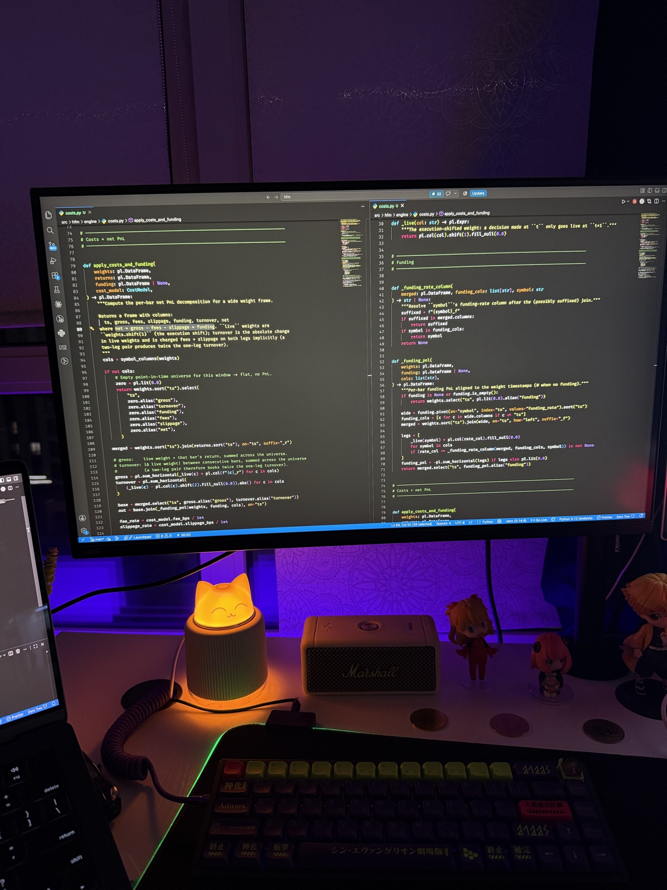
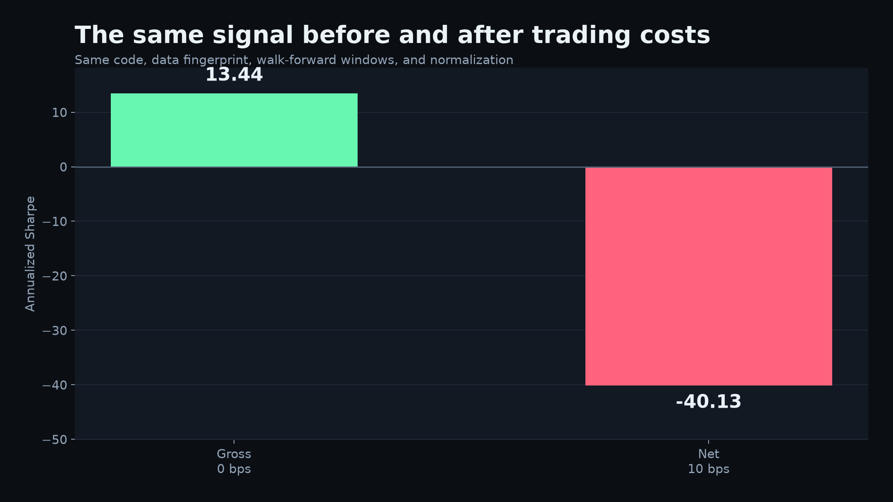
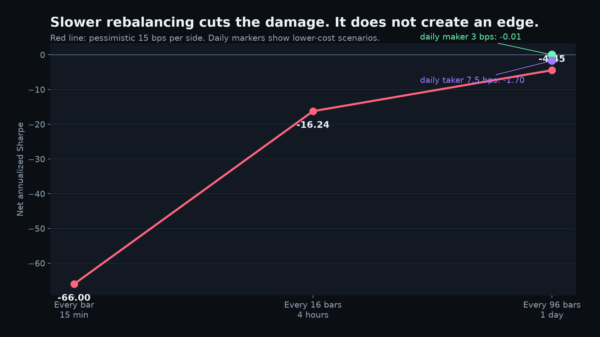

# My Crypto Backtest Had a Sharpe of 13.4. Then I Added Trading Costs

I was not trying to prove a grand theory about crypto. I was testing simple, falsifiable baselines and looking for one result worth a second experiment.

Cross-sectional reversal looked almost too clean: gross Sharpe `13.44`, with positive returns in `67 / 76` reported out-of-sample windows. Then I charged the same signal for the trading it required. At `10 bps` per side, net Sharpe fell to `-40.13`, and not one of those 76 windows remained positive.

That is not a typo. It is what can happen when a short-lived pattern asks for a new portfolio every 15 minutes.



*The less glamorous part of the experiment: execution delay, turnover, fees, slippage, and funding inside the same evaluation path.*

## What I actually tested

This article covers one intentionally narrow reproduction of H3, a cross-sectional reversal baseline, on cached Bybit USDT perpetual data:

- 15-minute bars from January 2021 to the pre-lockbox boundary in September 2025;
- an eight-bar, or two-hour, return signal;
- 90-day formation periods followed by 21-day OOS periods;
- 76 non-overlapping OOS windows, rolled every 21 days;
- causal volatility targeting at 10% annualized volatility, using a 96-bar trailing estimate and a 3× leverage cap;
- a sealed lockbox beginning September 1, 2025, which was not opened for this article.

The current cache contains `451` symbol directories. That is not the same thing as a properly reconstructed point-in-time liquid universe. The panel uses the histories available in the cache, but the current reproduction does not apply a historical liquidity screen. Survivorship and availability bias therefore remain possible. This result is a development diagnostic, not evidence of a deployable alpha.

## The signal was deliberately boring

At each timestamp, H3 measures every available asset's return over the previous eight bars, standardizes those returns across the cross-section, and reverses the sign.

Recent relative losers receive positive weights. Recent relative winners receive negative weights. The vector is scaled to unit gross exposure before portfolio-level volatility targeting.

The core signal is short enough to inspect:

```python
recent = prices.select(
    "ts", (pl.col(symbols) / pl.col(symbols).shift(config.lookback_bars) - 1.0)
)
long = recent.unpivot(
    index="ts", on=symbols, variable_name="symbol", value_name="return"
).drop_nulls("return")
stats = long.group_by("ts").agg(
    mean=pl.col("return").mean(),
    standard_deviation=pl.col("return").std(),
)
signal = long.join(stats, on="ts").with_columns(
    signal=pl.when(pl.col("standard_deviation") > 0)
    .then(-(pl.col("return") - pl.col("mean")) / pl.col("standard_deviation"))
    .otherwise(0.0)
)
gross = signal.group_by("ts").agg(
    gross_signal=pl.col("signal").abs().sum()
)
normalized = signal.join(gross, on="ts").with_columns(
    weight=pl.when(pl.col("gross_signal") > 0)
    .then(pl.col("signal") / pl.col("gross_signal"))
    .otherwise(0.0)
)
```

The production implementation also handles an empty cross-section and zero variance. No model is fitted here. There is no feature search hidden behind the result.

A weight computed at time `t` becomes live at `t+1`. The evaluator enforces that delay centrally:

```python
def live(column: str) -> pl.Expr:
    return pl.col(column).shift(1).fill_null(0.0)
```

Without the shift, the backtest would earn the same closing-bar return used to calculate the signal.

## The number that made me stop

With costs set to zero, the current run produced:

| Metric | Gross result |
|---|---:|
| Annualized Sharpe | `13.44` |
| Positive OOS windows | `67 / 76` (`88.2%`) |
| Maximum drawdown | `-11.62%` |
| Summed absolute turnover | `29,451` |

That last row is the warning. A huge gross Sharpe and huge turnover can be two descriptions of the same fragile result.



The comparison above is controlled: both bars come from the same code revision, data fingerprint, walk-forward windows, signal weights, and normalization. Only the cost model changes.

## Making the backtest pay its bill

Gross PnL uses execution-shifted weights. Turnover is the sum of absolute changes in live positions. Fees and slippage are fixed basis-point charges on turnover; funding is aligned separately with the long/short sign.

The accounting identity is explicit:

```python
fees = turnover * fee_bps / 10_000
slippage = turnover * slippage_bps / 10_000
net = gross - fees - slippage + funding
```

This is a rejection model, not an execution simulator. It does not model spread variation, order-book depth, queue position, partial fills, market impact, or adverse selection.

Using `6 bps` fees plus `4 bps` slippage per side, the same every-bar signal produced:

| Metric | Net result |
|---|---:|
| Annualized Sharpe | `-40.13` |
| Positive OOS windows | `0 / 76` |
| Cost / gross alpha | `4.00×` |
| Total return | approximately `-100%` |

The extreme Sharpe is less mysterious than it looks. A continuously refreshed cross-sectional portfolio creates persistent turnover. A relatively stable negative cost stream, annualized from 15-minute observations, can generate an absurdly negative ratio.

The useful result is not the theatrical `-40.13`. It is that the modeled trading bill was four times the gross PnL.

## Slowing the strategy down

The obvious response was to hold weights longer. Under a deliberately pessimistic `15 bps` per-side scenario, net Sharpe improved as turnover fell:

| Rebalance interval | Net Sharpe | Positive OOS windows |
|---|---:|---:|
| Every bar / 15 minutes | `-66.00` | `0 / 76` |
| Every 16 bars / 4 hours | `-16.24` | `0 / 76` |
| Every 96 bars / 1 day | `-4.45` | `10 / 76` |



The friendliest tested corner used daily rebalancing and `3 bps` per side. It reached a Sharpe of `-0.01`, with `39 / 76` positive windows. A `7.5 bps` daily scenario produced `-1.70`, with `27 / 76` positive windows.

Slower trading removed much of the damage, but it did not reveal a robust net edge. The signal decayed while it waited. And the maker-style scenario is especially optimistic because this vectorized test says nothing about queue position or whether a passive order would actually fill.

## What failed, and what did not

The experiment does not establish that “crypto mean reverts.” It shows a strong gross short-horizon reversal pattern inside this particular development sample and cache. It also shows that the naive implementation cannot capture that pattern after even simple modeled friction.

Those are different conclusions:

- **Research lead:** relative two-hour moves contain a repeatable gross pattern in this sample.
- **Failed strategy:** resizing the book continuously consumes more than the pattern earns.
- **Open engineering problem:** reduce turnover without waiting so long that the signal disappears.

That leaves specific follow-ups: threshold entries, hysteresis bands, cost-aware sizing, historical universe reconstruction, and a fill model for passive execution. None is assumed to work. They are simply better questions than adding more indicators to the same high-turnover baseline.

## Reproduction boundary

The internal HFM repository reproduces the article slice with two commands once the market-data cache exists:

```bash
PYTHONPATH=src python scripts/reproduce_round1_h3_article.py
PYTHONPATH=src python scripts/make_article_h3_charts.py
```

The first command rebuilds the panel and 76 walk-forward windows, evaluates all seven cost/rebalance scenarios, and writes machine-readable results. It also records the SHA-256 fingerprint of `1,442` cached files (`880,708,217` bytes), the hashes of every relevant source module, and the Python and Polars versions. The second command creates both figures directly from that result file.

The public companion repository contains the article, result snapshot, figures, minimal signal/cost code, deterministic tests, and a manifest that fails CI if any frozen artifact drifts. It does not distribute the market-data cache, so a reader can reproduce the mechanics and verify the published evidence package, but cannot independently regenerate the historical metrics without sourcing the data.

Before treating the numbers as anything stronger than development evidence, keep four limits attached:

1. The cached-symbol universe is not a point-in-time liquidity universe and may contain survivorship or availability bias.
2. Trading costs are fixed-bps assumptions, not observed live fills; maker scenarios omit queue and fill risk.
3. The sealed lockbox was not evaluated, and these are backtest results rather than live returns.
4. The 76 OOS windows do not overlap, but they are not 76 independent market regimes.

## The result I kept

I started the experiment hoping to find an edge. What survived was a better research rule: turnover belongs inside the hypothesis, not in the cleanup after a backtest looks good.

A gross Sharpe is not a strategy. It is a claim before execution. The strategy begins with what remains after the position delay, turnover, fees, slippage, funding, universe construction, and untouched data have all had their turn.

In this run, almost nothing remained.

Results file SHA-256: `7665f878d5de0264aae90367ff6c1fad0206a144a6e817128b7be621b4f9885a`
