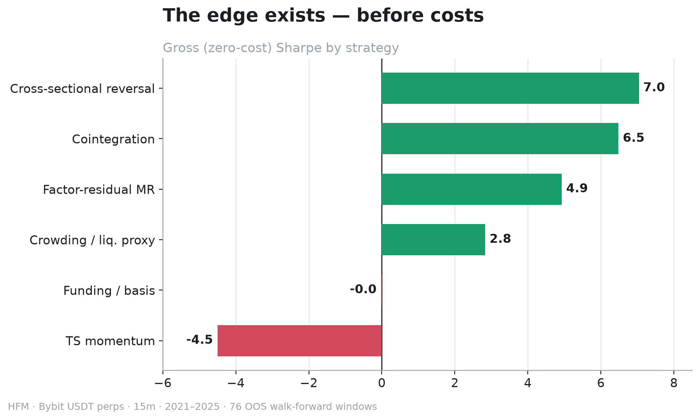
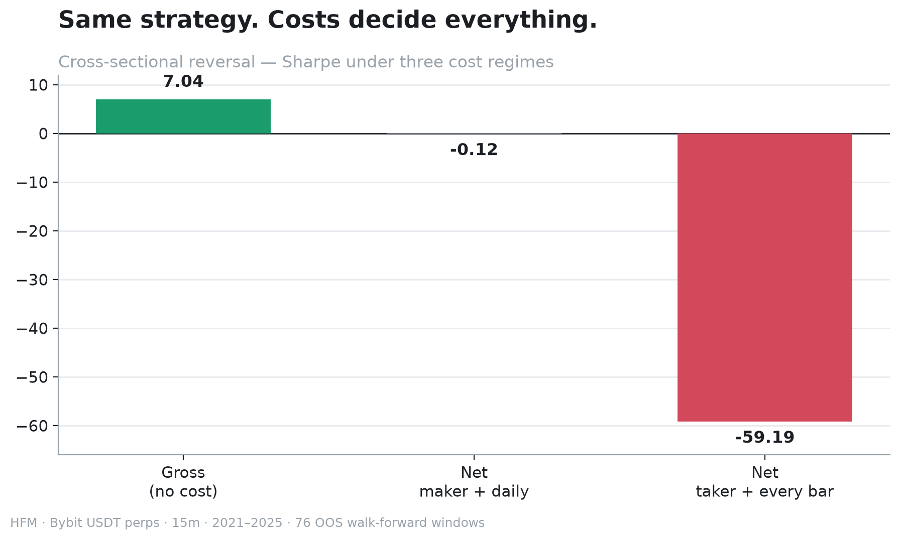

# My Crypto Strategy Had a Sharpe of 7. And Still Lost Money

I was not trying to prove a grand theory about crypto. I was working through simple, falsifiable baselines and looking for something worth a second experiment.

The third baseline looked almost too clean: gross Sharpe `7.04`, with positive returns in `83%` of the reported out-of-sample windows. Then I charged the strategy for the trading it required. Net Sharpe fell to `-59.48`, and none of the 76 windows remained positive.

That is not a typo. It is what can happen when a small short-lived pattern requires a new portfolio every 15 minutes.


*The less glamorous part of the experiment: execution delay, turnover, fees, slippage, and funding inside the same evaluation path.*

There is one important caveat up front: the gross result was produced before a backward-fill leakage fix, while the cost-inclusive run was produced after it. The report says the affected leading gaps were limited, but `7.04 → -59.48` is not a perfectly controlled before-and-after comparison. I still use the pair because it captures the failure mode, not because it proves an exact causal delta.

## The experiment

I tested six simple, ML-free relative-value baselines on Bybit USDT perpetual futures. The cross-sectional reversal baseline was H3.

- 30 liquid perpetuals in a point-in-time universe
- 15-minute bars from January 2021 through September 2025
- 90-day formation periods
- 21-day out-of-sample periods, rolled every 21 days
- 76 non-overlapping OOS windows
- a sealed lockbox beginning on September 1, 2025
- structure-preserving nulls that retained turnover and holding behavior while destroying directional information

Only out-of-sample segments contributed to the reported equity curve. A symbol entered the universe only after it had listed and left after delisting. That matters in crypto: treating today's survivors as if they had always existed quietly introduces survivorship bias.

## The signal was deliberately boring

At every 15-minute timestamp, H3 measured each asset's return over the previous eight bars (two hours, not eight days), standardized those returns across the current universe, then reversed the sign.

Recent relative losers received positive weights. Recent relative winners received negative weights. The vector was scaled to unit gross exposure.

The core implementation is short:

```python
recent = ordered.select(
    "ts",
    (pl.col(symbols) / pl.col(symbols).shift(config.lookback_bars) - 1.0),
)
long = recent.unpivot(
    index="ts", on=symbols, variable_name="symbol", value_name="return"
).drop_nulls("return")
stats = long.group_by("ts").agg(
    mean=pl.col("return").mean(),
    standard_deviation=pl.col("return").std(),
)
signal = long.join(stats, on="ts").with_columns(
    signal=pl.when(pl.col("standard_deviation") > 0)
    .then(-(pl.col("return") - pl.col("mean")) / pl.col("standard_deviation"))
    .otherwise(0.0)
)
gross = signal.group_by("ts").agg(gross_signal=pl.col("signal").abs().sum())
normalized = signal.join(gross, on="ts").with_columns(
    weight=pl.when(pl.col("gross_signal") > 0)
    .then(pl.col("signal") / pl.col("gross_signal"))
    .otherwise(0.0)
)
```

The production code handles empty universes and zero cross-sectional variance, but that is the mechanism. No model fitting and no hidden feature search.

A weight decided at time `t` becomes live at `t+1`. That execution shift is enforced by the evaluator rather than left to individual strategies:

```python
def live(column: str) -> pl.Expr:
    return pl.col(column).shift(1).fill_null(0.0)
```

Without that shift, the backtest would let the strategy trade on the same closing price used to calculate its signal.

## Why I initially took the result seriously

The zero-cost run reported a gross Sharpe of `7.04`, `83%` positive OOS windows, and a maximum drawdown near `-10%`.



A large number alone is not evidence. What caught my attention was that the result appeared across many walk-forward windows rather than coming from one lucky period. It was enough to justify the next question, not enough to call the strategy tradable:

> How much turnover does this signal need, and what survives after paying for it?

## Then I made the backtest pay its bill

The evaluator calculates gross PnL using execution-shifted weights. Turnover is the sum of absolute position changes. Fees and slippage are fixed basis-point charges applied to that turnover; funding is joined separately with the correct long/short sign.

The accounting identity is explicit:

```python
fees = turnover * fee_bps / 10_000
slippage = turnover * slippage_bps / 10_000
net = gross - fees - slippage + funding
```

This is not a market-impact simulator. It does not model order-book depth, queue position, partial fills, or a changing spread. It is a transparent fixed-bps friction model. That makes it useful for rejecting obviously uneconomic strategies, but it does not turn a backtest into live execution evidence.

With costs enabled and the signal refreshed every bar, cross-sectional reversal produced:

| Metric | Result |
|---|---:|
| Net Sharpe | `-59.48` |
| Positive OOS windows | `0 / 76` |
| Cost / gross alpha | `9.61×` |
| Total return in the cost run | approximately `-100%` |



The extreme negative Sharpe is less mysterious than it looks. Rebalancing a continuous cross-sectional signal every 15 minutes creates persistent turnover. A relatively stable negative cost stream, annualized at 15-minute frequency, can produce an absurdly negative Sharpe.

The useful number here is `9.61×`: modeled costs were almost ten times the gross PnL generated by this baseline run.

## Slowing the strategy down

The obvious response was to hold weights longer. Under the report's pessimistic `15 bps` per-side sensitivity, net Sharpe improved as turnover fell:

| Rebalance interval | Net Sharpe |
|---|---:|
| Every bar | `-59.2` |
| Every 16 bars / 4 hours | `-13.5` |
| Every 96 bars / 1 day | `-2.8` |

That recovered most of the catastrophic cost drag, but not a positive strategy. The signal decayed while it waited.

The friendliest reported corner used daily rebalancing and an approximately `3 bps` maker-cost assumption. Cross-sectional reversal reached `-0.12` Sharpe with half of the windows positive. Under the approximately `7.5 bps` taker scenario, it was `-1.82`.

Close to break-even is more interesting than `-59`, but it is still not an edge. Real maker execution would also introduce queue position and fill uncertainty that this vectorized test does not model.

## What actually failed

The experiment did not establish that “crypto mean reverts” in some universal sense. It found evidence of a gross short-horizon cross-sectional pattern in this development sample. It also showed that the naive implementation could not capture that pattern after modeled friction.

That distinction changed how I looked at the result:

- **The research lead:** relative two-hour moves showed a repeatable gross reversal pattern.
- **The failed strategy:** continuously resizing the entire book consumed far more than the pattern earned.
- **The engineering problem:** reduce turnover without waiting so long that the signal disappears.

The next experiments therefore became specific: threshold entries, hysteresis bands, cost-aware sizing, and a proper maker execution model. None of those is assumed to work. They are simply better questions than adding another indicator to the same high-turnover baseline.

## Reproduction and limits

The internal HFM run uses cached market data:

```bash
PYTHONPATH=src python scripts/ingest_bybit.py
PYTHONPATH=src python scripts/run_tournament_bybit.py
```

The second command is offline once the cache exists. It builds the point-in-time panel, generates the 76 walk-forward windows, evaluates all six entrants, runs the null transformations, and writes machine-readable artifacts.

Before treating the headline numbers as anything stronger than development evidence, keep these limits attached:

The reported gross Sharpe was measured before a backward-fill leakage fix, while the net cost sweep was measured after it; the report says the effect is minor, but the figures are not a perfectly identical pipeline comparison.

Transaction costs were modelled rather than paid, and maker execution would add queue and fill risk.

These are backtest results, not live trading returns.

Two more design details matter. The 76 rolling windows are not 76 fully independent market regimes, and the sealed lockbox was not used for this article. HFM classified every Round 1 baseline as `REJECT`.

## The result I kept

I started the experiment hoping to find an edge. Instead, it gave me a more useful habit: treat turnover as part of the hypothesis, not as cleanup performed after the backtest looks good.

A gross Sharpe is not a strategy. It is a claim before execution. The strategy begins with what remains after the position delay, turnover, fees, slippage, funding, and untouched data have all had their turn.

In this case, almost nothing remained.

Evidence snapshot: `dcd383ce6ca6b78b32e386580f70105c4b63a605941847633b45bbef2e868d07`
